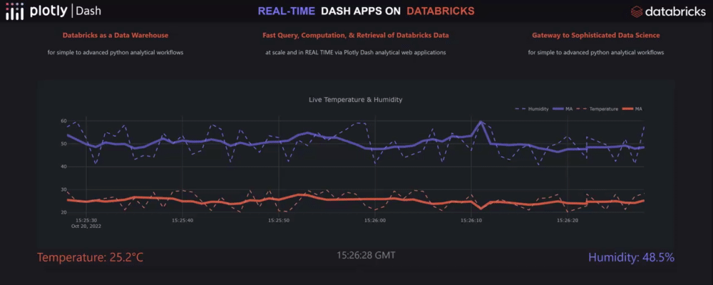

# Build Real-Time Production Data Apps with Databricks & Plotly Dash

Plotly on Databricks Blog Series — Article #2 (October/22)
If you are interested in using Dash with DBX on a large-scale Lakehouse, have a look at our other example [here](https://github.com/plotly/dash-dbx-sql). 

## Authors 
[Sachin Seth (Solutions Architect, Virago Analytics)](https://www.linkedin.com/in/sachin-seth-8b7b7222b/)

[Daniel Anton Suchy (Data Scientist, Plotly)](https://www.linkedin.com/in/daniel-anton-suchy/)

## Links
[Medium Article](https://plotlygraphs.medium.com/269cb64b7575)

[Plotly Dash App](https://dash-demo.plotly.host/dash-dbx-sql-realtime/)

# Overview

Python developers who want to make Plotly Dash web applications served by Databricks back end databases should make use of the Databricks SQL connector for Python. This library allows for a streamlined integration between Plotly Dash apps and Databricks which in turn enables developers to extend use cases beyond what was previously possible. Developers can now:

Create scalable and performant real-time streaming applications
Offload expensive SQL transformation to Databricks Photon engine
Design interactive and customizable dashboards for changing and very large data sets
Simplify back-end architecture

Additionally, the integration of Databricks and Plotly Dash gives those looking to visualize large streams of IoT data a means to do so. The combined effect of the Databricks Photon engine and the Plotly dcc.Interval component empowers developers to build highly responsive web applications for streams of IoT data directly from cloud-based storage. 

For more detailed information and a set-up guide, see the Medium article.

When launching the application, do not forget to set "SERVER_HOSTNAME", "HTTP_PATH", "ACCESS_TOKEN" environment variables.
